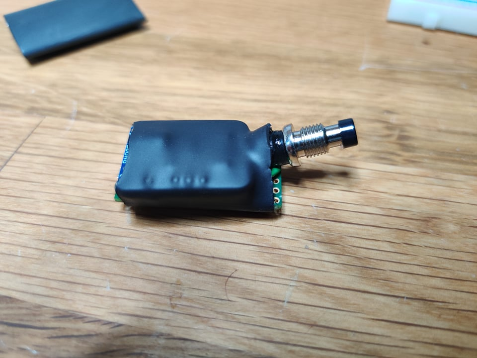
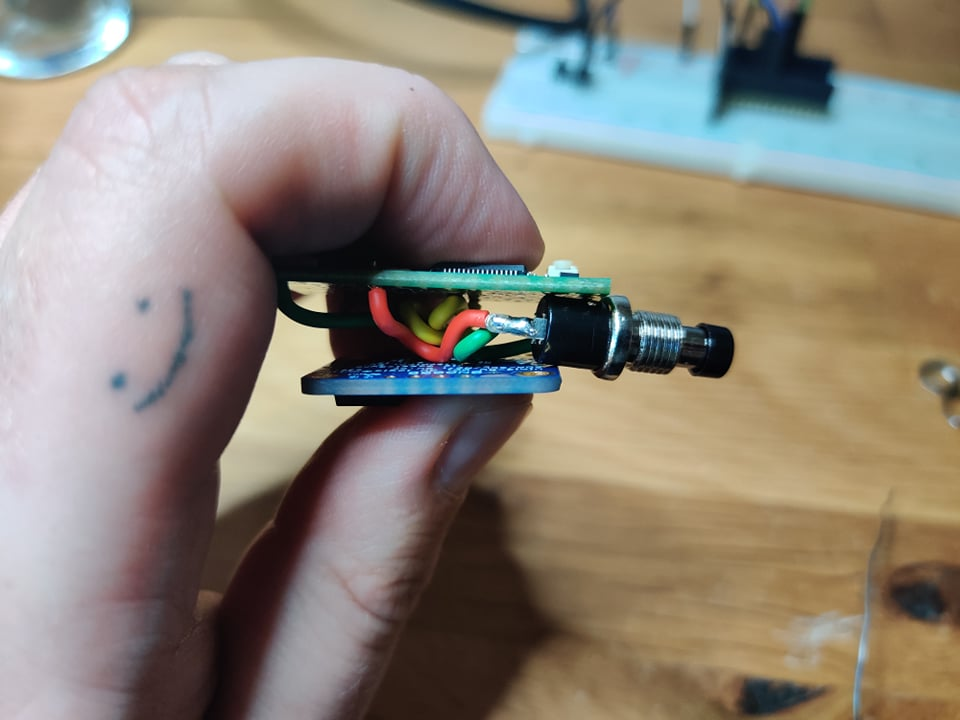

# Teensy Head Tracker




Teensy Head Tracker is a fork of IEM's [Mr Head Tracker](https://git.iem.at/DIY/MrHeadTracker). The main change is switching the hardware setup to use a Teensy to simplify things. The head tracker transmits the data as 14 bit midi and no middle ware is necessary to use it.

Teensy Head Tracker's main use case is the compensation of the user's head movement during
binaural synthesis of a 3D audio scene. Therefore, the device is mounted on
the user's headphones and provides rotation data with opposite direction.
The audio scene gets rotated using this data.

Alternatively, with the original, non-inverse rotation data the device can
be used as a controller/pointing-device for employment in live-performances
or automation-writing for 3D audio productions. Another thinkable application
is the tracking of a 3D microphone's orientation during recording for a a
posteriori stabilization of the recorded scene.

The device is designed to act as a class-compliant USB-MIDI device,
providing plug-and-play compatibility on Windows, macOS and Linux.
With the usage of 14-bit MIDI, the rotation data is provided with a resolution
high enough to be not noticeable.

The idea is to make 3D audio production tools more assessable for everyone
and allow the user to perceive a more realistic binaural playback without the
need of third party software or expensive hardware (e.g. optical tracking
system) and - above all - without the need of an expensive multichannel
audio playback system.

## Hardware

- Teensy 3.2
- [Adafruit BNO055 sensor](https://www.adafruit.com/product/2472) ( [Mouser link](https://no.mouser.com/ProductDetail/Adafruit/2472?qs=N%2F3wi2MvZWDmk8dteqdybw%3D%3D) )

## Connections

### BNO055 sensor
BNO055 	<-> 	TEENSY 

VIN 	<-> 	3.3V

GND 	<-> 	GND

SDA 	<-> 	18

SCL 	<-> 	19

### Button
BUTTON 	<-> 	TEENSY

PIN A 	<-> 	3

PIN B 	<-> 	GND

## TODO

- Enclosure

## Software requirements:
- Platformio
- Teensyduino

## Uploading to the Teensy

With Platformio installed, download this repository and move into it using a terminal. Then run:
```
platformio run -t upload
```

## Calibration process

When first put into operation, the MrHeadTracker won't start sending rotation data until a full calibration was performed.
To do so:

1. look into your desired front direction
2. press and hold the push button for longer than 1s
3. release
4. nod/tilt your head forwards
5. press the button again while looking downward.

The calibration data is saved into the EEPROM memory and has to be done only when the mounting position has changed. 

## Changing front orientation
For changing the desired front orientation just press and release the push button shortly (below 1s). 

This is useful if the sensor starts drifting.

## Using it in Reaper
Usage in REAPER:
1. Add the "IEM SceneRotator" to an ambisonics track (before the decoder)
2. Open up the SceneRotator plugin
3. At the bottom of the panel, click the device drop down and choose "Teensy Head Tracker"
4. In the scheme, choose the scheme corresponding to the mode of the head tracker. By default it is Yaw Pitch Roll Direct. If you haven't changed it, choose "Mr HT YPR Direct"

## Changes from Mr Head Tracker

- Use Teensy (and Teensy's EEPROM and MIDI libs) instead of Arduino
- Converted to platformio project
- Use Bounce for debouncing
- Various small changes to the code

